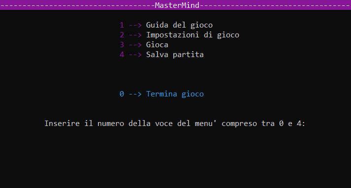

# Mastermind-c
Mastermind game in C (University project), built in Eclipse (our teacher forced us to use this crappy compiler, and also prohibited us from using switch, for, break, and other statements. We also had a limit of returns to use in a function, and had to handle variables, data and globals in a specific way...

# 🕹 Game
The game is quite simple: a random string of X integers is generated and u have to guess it; you insert a possible combination, if its correct u win, if its not the game will tell you the exact number of integers in the correct position and in a wrong position. You have Y attempts, if u lose u can see the correct combination, and u can also save the game and resume it whenever u want (as long as the data path works xd).

# 💻 Code

Simple terminal interface (in italian), you can manage the settings to edit the difficulty of the game and other stuff like n° of attempts, n° of integers generated, etc. 
The menu gives u 4 options:
- Check out the rules of the game;
- 
